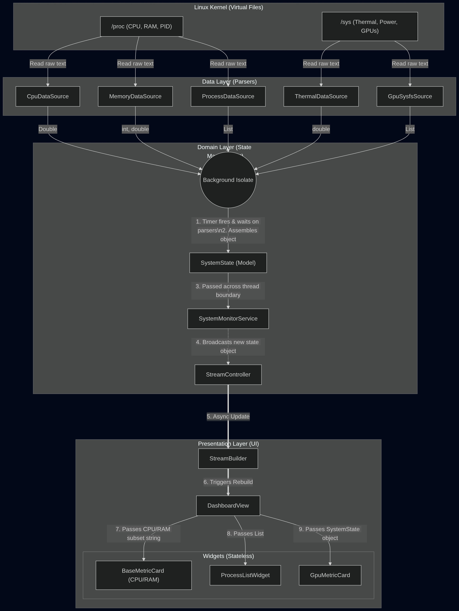

# FlutterTop 🚀

[](https://flutter.dev)
[](https://opensource.org/licenses/MIT)

**FlutterTop** is a visually stunning, modern Linux system monitoring dashboard built with Flutter. It provides real-time insights into your system's performance with beautiful animations and a clean, intuitive interface.


## 📖 Motivation & Background

The motivation behind FlutterTop stems from my experiences throughout the Canonical interview process and the time I spent diving deep into the Snap ecosystem and Linux application development.

Previously, I found myself using many different terminal and GUI resource monitors simultaneously. This often felt like it caused shared resource contention, and the fragmented experience left much to be desired. I wanted to create a more **unified interface** using a highly aesthetic, premium GUI that brings all essential system metrics into one beautiful dashboard.

*Note: AI was used as a part of this project, primarily to help format code and to bring to life some of the complex UI and glassmorphic aspects of the application.*

## 🏗️ Architecture

The project is structured around a strict Clean Architecture approach, utilizing **three main layers** to separate UI rendering from low-level Linux system parsing:



1. **Presentation Layer**: Handles the aesthetic UI, animations, and reactive state visualizations.
2. **Domain Layer**: Contains the core business logic, entity models, and the services orchestrating the data streams.
3. **Data Layer**: Manages the highly-optimized, asynchronous parsing of `/proc` and `/sys` file systems.

## ✨ Features

- **CPU Monitoring**: Detailed per-core heatmaps and overall usage history.
- **Memory & Swap**: Visualized usage stats for physical RAM and swap space.
- **Disk & Storage**: Real-time I/O tracking and storage capacity pie charts.
- **GPU Stats**: Dedicated metrics for AMD and NVIDIA hardware.
- **Network I/O**: Live upload and download speeds per interface.
- **Process Management**: Deep profiling of individual processes, including hardware events (page faults) and software events (context switches).

## 📦 Installation

### Install via Snap (Recommended)

FlutterTop is packaged as a Snap for easy installation on most Linux distributions:

```bash
# Once published to the store:
sudo snap install fluttertop

# To install the local build (experimental):
sudo snap install fluttertop_*.snap --dangerous
```

### Build from Source

Ensure you have [Flutter installed](https://docs.flutter.dev/get-started/install/linux).

1. Clone the repository:

   ```bash
   git clone https://github.com/deepMind1234/fluttertop.git
   cd fluttertop
   ```

2. Get dependencies:

   ```bash
   flutter pub get
   ```

3. Run the application:

   ```bash
   flutter run -d linux
   ```

## 🛠 Development

### Snapcraft Build

To package the application as a snap locally:

```bash
snapcraft pack
```

### Static Analysis

Keep the codebase clean by running:

```bash
flutter analyze
```

## 📄 License

This project is licensed under the MIT License - see the [LICENSE](LICENSE) file for details.

---
Created with ❤️ by **[soulful](https://github.com/deepMind1234)**
